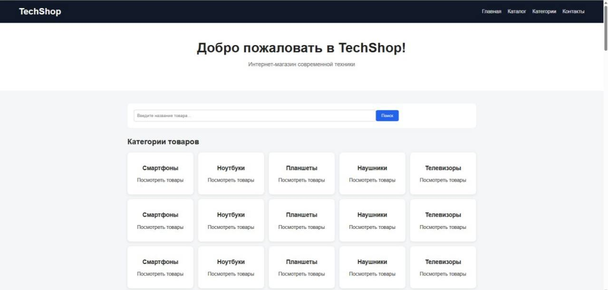
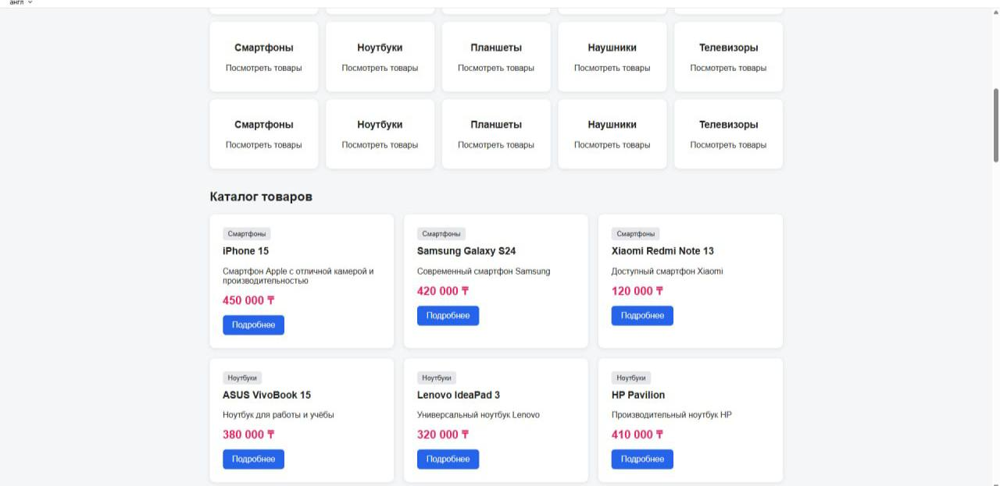
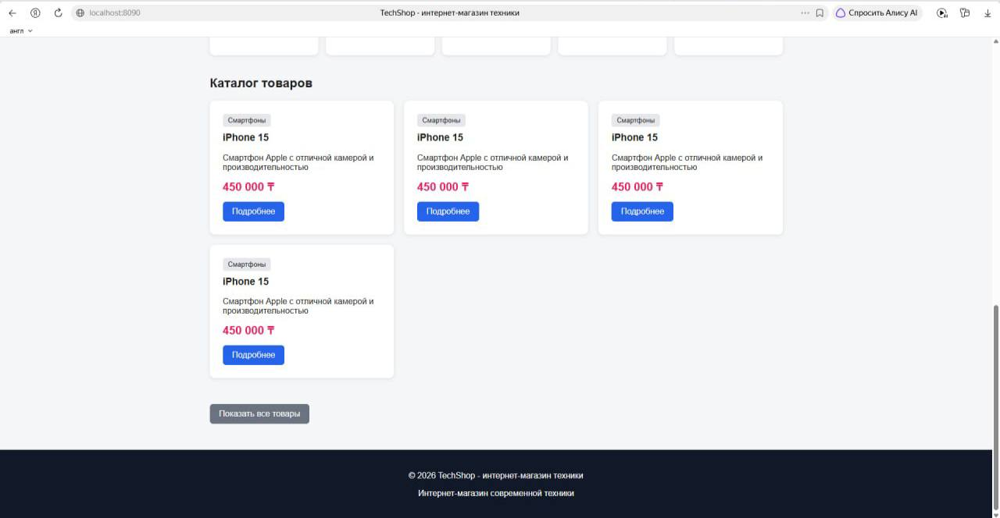
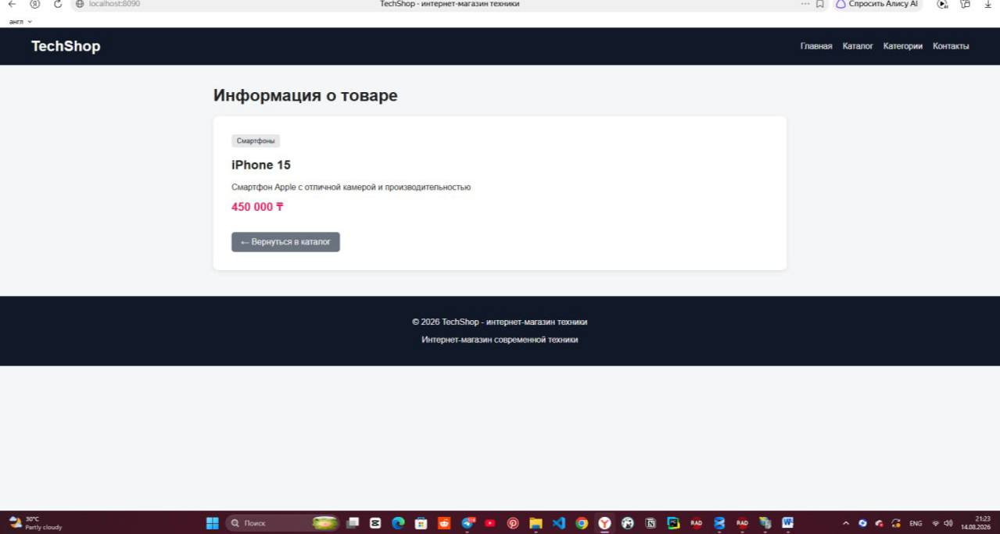

# final-project
# TechShop — веб-приложение интернет-магазина по продаже техники

## О проекте

Проект создан в рамках учебной практики в университете Синергия 
Проект разработан с использованием **Delphi 12**, **Microsoft IIS** и **Microsoft SQL Server**.

Приложение получает данные о товарах из базы данных `TechShopDB`(можно посмотреть в TechShopDBGit.sql) и показывает их в веб-интерфейсе.

## Технологии

- Delphi
- Object Pascal
- Microsoft IIS
- Microsoft SQL Server
- ADO
- HTML
- CSS

## Архитектура проекта
Пользователь-Веб-браузер-Microsoft-IIS-Delphi-Web Application-ADO-Microsoft-SQL Server-TechShopDB

## Интерфейс:
Веб-приложение содержит:

-главную страницу;
-поиск товаров;
-категории товаров;
-каталог;
-информацию о магазине;
-контактную информацию.

## Скриншоты

-Главная страница

На главной странице представлены категории товаров и реализована поисковая система.

Ниже категорий товаров расположен каталог, данные которого загружаются непосредственно из базы данных. В каталоге отображаются товары, доступные в наличии.

На данном скриншоте продемонстрирована работа поисковой системы. После ввода поискового запроса товары автоматически фильтруются в соответствии с запросом пользователя.

Как видно на предыдущих скриншотах, на сайте предусмотрена кнопка «Подробнее». При её нажатии покупатель\пользователь переходит на страницу с подробной информацией о выбранном товаре.
На странице товара также расположена кнопка «Вернуться в каталог». При её нажатии пользователь возвращается на главную страницу сайта. 

## Проведите анализ и опишите имеющихся на рынке программного обеспечения информационных систем, построенных по архитектуре WEB-приложений. 
## Оцените и опишите возможности предлагаемых систем по архитектуре WEB-приложений и варианты их использования в компании.

# Анализ информационных систем, построенных по архитектуре WEB-приложений

## 1. Введение

Веб-приложение представляет собой информационную систему, доступ к которой осуществляется через веб-браузер. 
Такая система включает несколько взаимосвязанных компонентов: пользовательский интерфейс, веб-сервер, серверную часть приложения и базу данных.
Общую схему взаимодействия компонентов веб-приложения можно представить следующим образом:
Пользователь-Веб-браузер-Веб-сервер-WEB-приложение-База данных
Пользователь взаимодействует с системой через веб-браузер. После выполнения определённого действия браузер отправляет HTTP-запрос на веб-сервер. Веб-сервер передаёт запрос серверной части приложения, которая обрабатывает его и при необходимости обращается к базе данных.
- После получения необходимой информации приложение формирует ответ, который через веб-сервер возвращается в браузер пользователя.
- Таким образом, веб-архитектура обеспечивает взаимодействие пользователя с информационной системой и позволяет разделить пользовательский интерфейс, серверную логику и хранение данных.

## 2. Принцип работы архитектуры WEB-приложений

Большинство современных веб-приложений можно разделить на две основные части:

-клиентскую часть (Front-end);
-серверную часть (Back-end).
## 2.1. Клиентская часть (Front-end)

Front-end представляет собой визуальную часть веб-приложения, с которой непосредственно взаимодействует пользователь.

Клиентская часть отвечает за:
отображение веб-страниц;
кнопки и элементы управления;
формы ввода;
меню и навигацию;
отображение информации;
реакцию интерфейса на действия пользователя.

Для создания клиентской части используются HTML, CSS, JavaScript и различные библиотеки и фреймворки.

Например, при вводе пользователем данных в форму регистрации он взаимодействует с клиентской частью приложения.

##2.2. Серверная часть (Back-end)

Back-end работает на сервере и не отображается пользователю напрямую.

Основные задачи серверной части:

-обработка HTTP-запросов;
-выполнение бизнес-логики;
-проверка данных;
-взаимодействие с базой данных;
-обработка информации;
-формирование ответа пользователю;
-обеспечение безопасности приложения.

## Например, после заполнения формы регистрации пользователь нажимает кнопку «Зарегистрироваться». Браузер отправляет данные на сервер, где они проверяются и при необходимости сохраняются в базе данных.

Таким образом, Front-end отвечает преимущественно за взаимодействие с пользователем, а Back-end — за обработку запросов, выполнение бизнес-логики и работу с данными.

##3. Уровни архитектуры веб-приложений

Для более подробного рассмотрения внутреннего устройства веб-приложения можно выделить несколько логических уровней:

-Уровень представления (Presentation Layer, PL);
-Уровень бизнес-логики (Business Logic Layer, BLL);
-Уровень служб данных (Data Service Layer, DSL);
-Уровень доступа к данным (Data Access Layer, DAL).
Разделение приложения на уровни позволяет распределить обязанности между компонентами системы и сделать её разработку и сопровождение более удобными.

## 3.1. Уровень представления (PL)

Уровень представления отвечает за взаимодействие пользователя с веб-приложением.

Он включает:

-веб-страницы;
-формы;
-кнопки;
-меню;
-таблицы;
-карточки товаров;
-результаты поиска;
-другие элементы пользовательского интерфейса.

Основная задача уровня представления заключается в получении действий пользователя, передаче соответствующего запроса на обработку и отображении полученного результата.

В проекте TechShop к уровню представления относятся главная страница, каталог товаров, категории, поисковая система и страницы с информацией о товарах.

## 3.2. Уровень бизнес-логики (BLL)

Уровень бизнес-логики отвечает за правила работы информационной системы и выполнение основных операций.

Например, в интернет-магазине бизнес-логика может отвечать за:

-поиск товаров;
-фильтрацию каталога;
-проверку наличия товаров;
-обработку заказов;
-регистрацию пользователей;
-расчёт стоимости заказа.

Таким образом, данный уровень определяет, каким образом система должна реагировать на действия пользователя.

## 3.3. Уровень служб данных (DSL)

Уровень служб данных обеспечивает взаимодействие между бизнес-логикой и данными приложения.

Он используется для получения, обработки и передачи необходимой информации между отдельными компонентами системы.

Например, когда пользователь выполняет поиск товара, запрос передаётся серверной части приложения, которая получает соответствующие данные и возвращает результат поиска пользователю.

Разделение данного уровня позволяет сделать структуру приложения более организованной и облегчает дальнейшее развитие системы.

## 3.4. Уровень доступа к данным (DAL)

Уровень доступа к данным отвечает за взаимодействие приложения с источниками хранения информации.

В качестве источников данных могут использоваться:

реляционные базы данных;
файлы;
XML-документы;
другие системы хранения.

DAL обеспечивает выполнение основных операций с данными:

-Create — создание;
-Read — чтение;
-Update — изменение;
-Delete — удаление.

В разработанном проекте TechShop уровень доступа к данным обеспечивает взаимодействие с базой данных Microsoft SQL Server посредством технологии ADO.

## 4. Типы архитектуры WEB-приложений

Существует несколько основных подходов к построению веб-приложений. Они отличаются способом распределения логики между клиентской и серверной сторонами, принципом обработки запросов и организацией взаимодействия с пользователем.

Наиболее распространёнными являются:

-SPA — одностраничные приложения;
-MPA — многостраничные приложения;
-микросервисная архитектура;
-бессерверная архитектура;
-PWA — прогрессивные веб-приложения.
# 5. SPA — одностраничные веб-приложения

SPA (Single Page Application) — это веб-приложение, в котором основная страница загружается один раз, а отдельные элементы интерфейса изменяются динамически без полной перезагрузки страницы.

Для обмена данными между клиентской и серверной частями часто используются API.

## Основные особенности
-первоначальная загрузка основной страницы;
-динамическое обновление содержимого;
-высокая интерактивность;
-активное использование JavaScript;
-взаимодействие с сервером через API.
-Примеры технологий
-React;
-Angular;
-Vue.js.
## Возможности использования
SPA может применяться для:

-CRM-систем;
-личных кабинетов;
-корпоративных информационных систем;
-аналитических панелей;
-систем управления проектами;
-онлайн-банкинга.

## Преимущества
-После первоначальной загрузки пользователь может быстро взаимодействовать с интерфейсом без постоянной полной перезагрузки страниц
## Недостатки

Разработка SPA может быть сложнее по сравнению с традиционными веб-приложениями, поскольку требуется более сложная клиентская логика.

## 6. MPA — многостраничные веб-приложения

MPA (Multi-Page Application) — это традиционный тип веб-приложения, состоящий из нескольких отдельных страниц.

При переходе пользователя на другой раздел браузер отправляет новый запрос серверу, после чего сервер формирует и возвращает новую страницу.

# Основные особенности
-наличие нескольких отдельных страниц;
-обработка запросов на сервере;
-переход между разделами приложения;
-возможность использования традиционных серверных технологий.
# Возможности использования

MPA подходит для:

-интернет-магазинов;
-корпоративных сайтов;
-информационных порталов;
-новостных сайтов;
-образовательных систем.

# Преимущества
-относительно простая организация;
-хорошая совместимость с поисковыми системами;

# Анализ современных фреймворков для WEB-приложений

Для разработки WEB-приложений используются различные фреймворки. Они помогают ускорить разработку, организовать структуру проекта и реализовать взаимодействие между пользователем, сервером и базой данных.

## 7. Front-end фреймворки

### React

React — популярная JavaScript-библиотека для создания пользовательских интерфейсов. Основой является компонентный подход, позволяющий разбивать интерфейс на отдельные переиспользуемые элементы.

**Преимущества:**
- высокая популярность;
- большое количество библиотек;
- удобное создание интерактивных интерфейсов;
- повторное использование компонентов.

**Недостатки:**
- для некоторых задач нужны дополнительные библиотеки;
- изучение управления состоянием может быть сложным для начинающих.

### Vue.js

Vue.js — JavaScript-фреймворк для создания интерфейсов и веб-приложений. Он отличается относительно простым синтаксисом и подходит как для небольших сайтов, так и для более сложных систем.

**Преимущества:**
- простой для изучения;
- гибкий;
- компонентная архитектура;
- хорошая производительность.

**Недостатки:**
- экосистема меньше, чем у React;
- для крупных проектов требуется дополнительная архитектура.

### Angular

Angular — полноценный фреймворк на TypeScript, который часто применяется для крупных корпоративных веб-приложений.

**Преимущества:**
- большое количество встроенных инструментов;
- строгая структура проекта;
- поддержка TypeScript;
- подходит для крупных систем.

**Недостатки:**
- более сложный для изучения;
- для небольших проектов может быть избыточным.

---

## Back-end фреймворки

### Django

Django — веб-фреймворк на Python. Используется для создания интернет-магазинов, информационных систем, образовательных платформ и API.

**Преимущества:**
- большое количество готовых инструментов;
- ORM для работы с базами данных;
- административная панель;
- встроенные механизмы безопасности.

**Недостатки:**
- для небольших проектов может быть избыточным.

### Node.js + Express

Express — серверный фреймворк для Node.js. Он используется для создания серверных приложений и API.

**Преимущества:**
- JavaScript используется на клиентской и серверной стороне;
- большое количество дополнительных библиотек;
- подходит для создания API.

**Недостатки:**
- многие функции необходимо подключать дополнительно;
- разработчик самостоятельно определяет структуру проекта.

### Spring Boot

Spring Boot — фреймворк для Java, который широко используется при создании корпоративных приложений, REST API и микросервисов.

**Преимущества:**
- подходит для крупных систем;
- большое количество готовых компонентов;
- хорошая поддержка микросервисной архитектуры.

**Недостатки:**
- высокий порог входа;
- большое количество возможностей усложняет изучение.

---

## Full-stack фреймворки

### Laravel

Laravel — PHP-фреймворк для разработки веб-приложений. Он используется при создании интернет-магазинов, CMS, корпоративных сайтов и SaaS-сервисов.

**Преимущества:**
- удобная работа с базами данных;
- встроенная маршрутизация;
- система шаблонов;
- большое количество готовых инструментов.

**Недостатки:**
- требуется знание PHP;
- крупные проекты требуют дополнительной оптимизации.

# 8. Заключение

В ходе выполнения работы были рассмотрены особенности информационных систем, построенных по архитектуре WEB-приложений, их основные компоненты, уровни и способы взаимодействия между пользователем, веб-сервером, приложением и базой данных.

Были рассмотрены основные виды WEB-архитектур: SPA, MPA, микросервисная, бессерверная архитектура и PWA. Каждый подход имеет свои преимущества и ограничения. Выбор конкретной архитектуры зависит от назначения системы, количества пользователей, требований к производительности, безопасности, масштабируемости и удобству сопровождения.

Также были проанализированы современные фреймворки для разработки WEB-приложений: React, Vue.js, Angular, Django, Node.js + Express, Spring Boot и Laravel. Front-end фреймворки преимущественно используются для создания пользовательского интерфейса, а Back-end технологии обеспечивают обработку запросов, бизнес-логику и взаимодействие с базой данных.

WEB-приложения могут широко использоваться в компаниях для автоматизации различных процессов: управления товарами и складом, работы с клиентами, ведения документации, формирования отчетов, организации продаж и предоставления сотрудникам доступа к корпоративной информации.

В рамках практической части был разработан WEB-проект **TechShop**, представляющий собой информационную систему интернет-магазина техники. Приложение взаимодействует с базой данных **Microsoft SQL Server** и предоставляет пользователю каталог товаров, категории, поиск и просмотр информации о товарах. Для реализации проекта использовались **Delphi, Microsoft IIS, ADO, HTML и CSS**.

Таким образом, WEB-архитектура является универсальным решением для создания информационных систем различного назначения. Она позволяет централизованно хранить и обрабатывать данные, предоставлять пользователям доступ к системе через браузер и при необходимости расширять функциональность приложения. Правильно выбранная архитектура позволяет компании повысить эффективность работы, автоматизировать процессы и обеспечить удобный доступ к необходимой информации.
